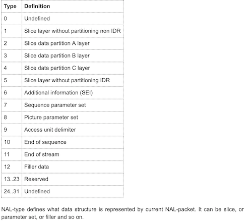
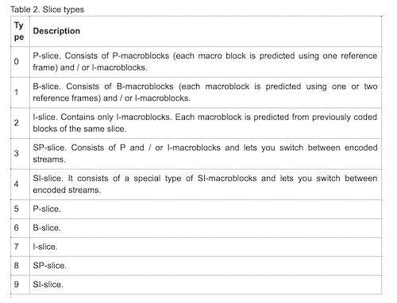
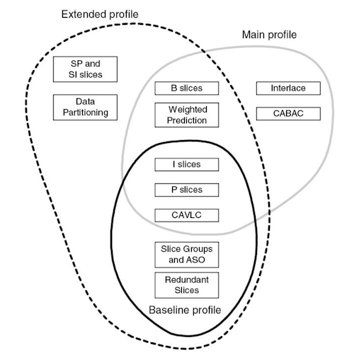
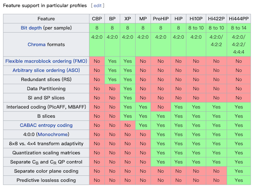
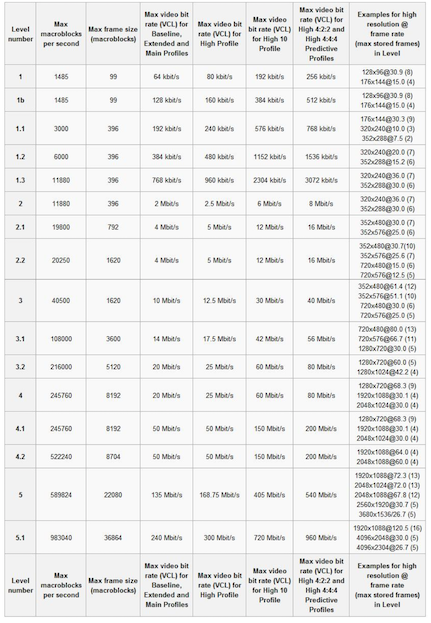

## h264、aac 篇

> 上文解释的 ts 属于视频封装格式,而 h264、aac 属于编码格式,是对音视频高效的压缩算法标准。

为什么需要视频压缩

1 个 1080p 25fps 时长 1h 的视频，如果未经压缩,需要 1920 x 1080 x 24(一个像素点颜色由 rgb 三原色组成) x 25 x 3600(s) = 521 GB 字节表示,对于存储、网络传输压力巨大。音视频编码标准旨在用更低的码率来表示和原片相近的画质。

> h264 即 MEPGE-4 part 10, Advanced Video Coding(AVC),是目前应用较广泛的的视频压缩标准。关于音视频编码原理介绍，可参考[https://github.com/leandromoreira/digital_video_introduction],[https://www.freehacker.cn/media/codec-h264/],本文主要介绍 avc、aac 编码后的音视频数据的结构化表示,即 NAL、ADTS。

> aac 即 Advanced Audio Coding,是 MP3 音频编码格式的代替品,aac 相较 mp3 在相同码率下能提供更好的音质.

对 H264 的文档说明参见[ISO-14496-10](https://www.iso.org/standard/75400.html)

对 AAC 的文档说明参见[ISO-138181-7](https://www.iso.org/standard/43345.html)

### NAL

> H.264 多个图像组成一个视频系列（GOP）,`例如1个10s的 ts 分片,包含 250帧`，每个图像由一帧（Frame）组成。帧又可以分成`一个或几个片（Slice）`。片由宏块（Macro Block）组成，一帧中每个片的宏块数不一定相同。每个宏块由一个 16×16 的亮度数组和两个 8×8 的色差数组组成。一个 720×480 分辨率的图像可以被划分为 1350（45×30）个宏块。


> 宏块是编码处理的基本单元。一个帧是可以分割成一个或多个片来编码的，构成 I_Slice、P_Slice、B_Slice、SP_Slice 和 SI_Slice，而一个片编码之后被打包进一个 NAL unit。编码片相互间独立，这样做的目的是为了限制误码的扩散和传输。

Nal unit 由[Nal start code(0x001 或 0x0001)][nal header][payload] 组成。 header 中 有 nal_unit_type 标记(字节后 5 位) 代表了此 unit 的类型.


主要的 Nal unit 类型:



5: IDR 帧,即 I 帧,但是 I 帧不一定是 IDR 帧 (例如 nalType = 1,slideType = 2 的 I slide 也代表 I 帧),IDR 帧是强制刷新帧，在解码过程中，当出现了 IDR 帧时，要更新 sps、pps，原因是防止前面 I 帧错误，导致 sps，pps 参考 I 帧导致无法纠正。一般在一个 ts 分片开始的第一个图片帧就是 IDR 帧。

1: 代表切片,I slice、B slice、P slice、SP slice、SI slice



6: SEI ,附加增强信息,例如存储 文字信息 [https://zhuanlan.zhihu.com/p/33720871]

7: SPS (sequence parameter set),保存着 GOP 的全局参数,例如视频宽高、初始化解码器的 profile、level 信息

8: PPS (picture parameter set),解码图片需要依赖的参数

9: access unit 分割符, access unit 代表一个采样,一个采样可以由一到多个 nal unit 组成。

对 sps pps 的详细说明可参考[https://zhuanlan.zhihu.com/p/27896239]

#### Profile

> H264 标准定义了一系列的能力,这些能力被划分成多个等级,叫做 Profile,每一种 Profile 使用 h264 标准定义的编码特性的一个子集,Profile 越高,使用的编码压缩特性越高级。编码器会基于指定的 Profile 来压缩视频,解码器也必须根据 Profile 来决定使用那些编码特性来解压视频。

基本 Profile 类型:

- Baseline Profile(66)

- Extended Profile (88)

- Main Profile (77)

- High Profile (100)

不同 Profile 使用的 h264 编码特性集



完整的 Profile 列表:



#### Level

> Level 是对视频本身特性的描述（码率、分辨率、帧率）, 指定解码器必须能够处理的视频的大小,指定视频的最大比特率和每秒宏块的最大数量。Level 范围从 1 到 5,(如 1.1、1.2、3.1 等)。

每一种 level 指定如下限制的具体值:



### AAC

> 高级音频编码,属于有损数字音频压缩,最早定义在 ISO-13818-7,后被用于 MPEG-4(ISO-14496-3).AAC 可支持最多 48 个全音域音频通道,采样率范围 8kHz 到 96kHz。

#### 主要的 Profile

和 h264 类似, aac 标准也定义一系列压缩特性,以适应不同场景,主要的 Profile 包括:

- AAC LC(Low Complexity) 此 Profile 在中等码率的编码效率以及音质方面，都能找到平衡点。所谓中等码率，就是指：96kbps-192kbps 之间的码率

- AAL HE(High Efficiency) 融入了 Mp3Pro 中的那种 SBR 技术,适合用于低码率编码，所谓低码率,就是指: 32kbps-96kbps 之间的码率

- AAL Main 用于较高码率的编码,音质最好,192kbps-384kbps,如果码率不超过 256kbps,AAC-LC 也同样适用

#### aac 容器格式 ADTS

ADTS 是 ts 中对 aac 编码的音频数据的封装格式,由 7 或 9 字节(取决于有无 CRC) + payload(音频的 raw data) 组成。

ADTS header

```
* syncword   12 bit, all is 1
* ID         1bit 【0 for MPEG-4, 1 for MPEG-2】
* layer      2 bit '00'
* protection_absent  1bit 【set to 1 if there is no CRC and 0 if there is CRC】
* profile    2 bit   【0:null,1:Main profile、2:LC、3:SSR 4:LTP、5:SBR、...】【第二字节前两位】
* sampling_frequency_index  4 bit
* private_bit  1 bit
* channel_configuration  3 bit 【第三字节最后一位 + 第四字节前2位】
* originality  1 bit
* home         1 bit
* copyrighted id bit   1 bit
* copyright id start   1 bit
* frame length         13 bit【第四字节后2bit + 第五字节 + 第六字节前3bit】
* FrameLength = (ProtectionAbsent == 1 ? 7 : 9) + size(AACFrame)
* Buffer fullness      11 bit 【第六字节后5位 + 第七字节前6位】
* Number of AAC frames  2 bit  【第七字节后2位】
* CRC if protection absent is 0   16 bit 【8、9字节】

```

音频一帧的时长计算:

1 帧 = 1024 采样,对于采样率为 44.1Khz 的音频, 1 帧 = 1024 \* (90K / 44.1K) ≈ 2089.8 (timestamp) = 23.2 (ms)

> 对 ts 流的解析,最终是要从 PES 中提取音视频的采样数据,然后将这些采样数据重新塞到 浏览器可直接识别的 MP4 封装格式中. 参见下篇 [mp4](./mp4.md)

## 相关链接

- [H.264/MPEG-4 AVC 学习](https://www.freehacker.cn/media/codec-h264/)

- [ISO-14496-10](https://www.iso.org/standard/75400.html)

- [ISO-138181-7](https://www.iso.org/standard/43345.html)

- [digital_video_introduction](https://github.com/leandromoreira/digital_video_introduction)

- [wiki MPEG-4_AVC](https://en.wikipedia.org/wiki/H.264/MPEG-4_AVC)

- [H.264 码流结构](https://juejin.im/post/5a8fe66b6fb9a0633e51eadc)

- [H264 码流中 SPS PPS 详解](https://zhuanlan.zhihu.com/p/27896239)

- [FFmpeg 从入门到精通——进阶篇，SEI 那些事儿](https://zhuanlan.zhihu.com/p/33720871)
