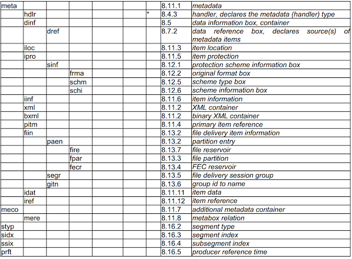
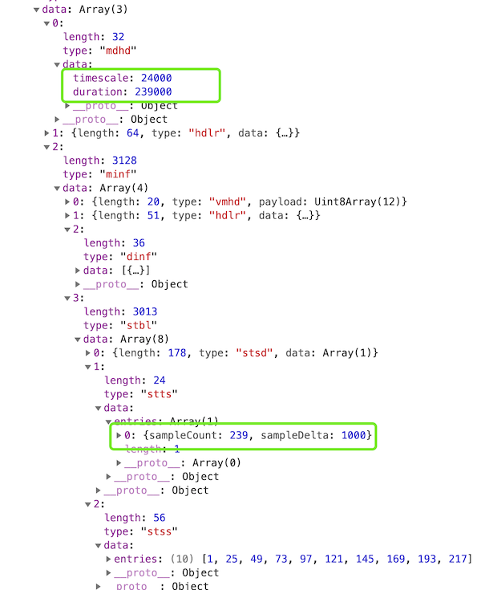
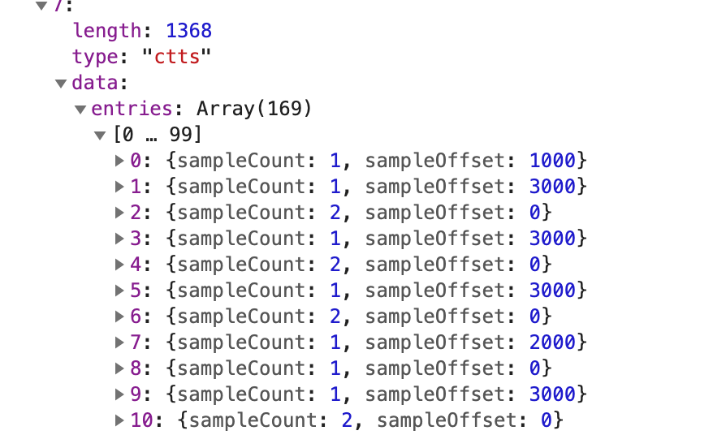
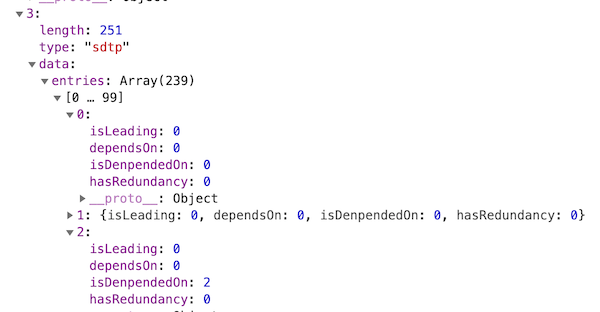
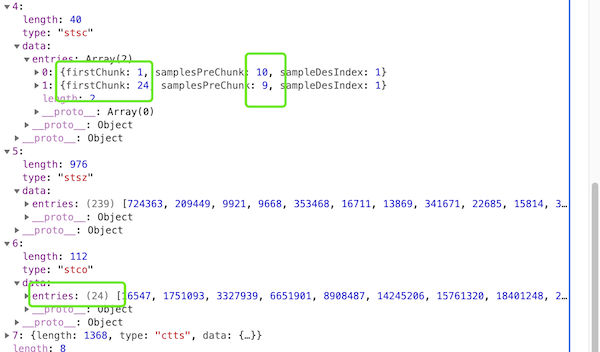
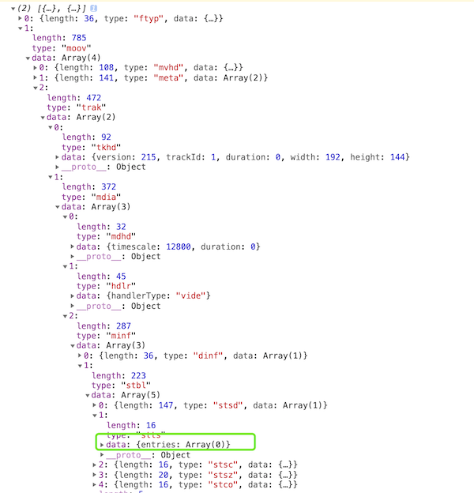
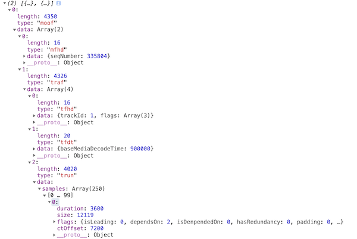

## mp4

> 介绍 MP4 之前需要先了解 ISO Base Media Format,规范见(iso 14496-12 即 MPEG-4 part 12),mp4 格式是在 iso bmff 基础上进行扩展,MP4 规范文档参见 (iso 14496 -14).

> iso bmff 为基于时间的多媒体文件(音频、视频) 定义了一种通用的结构, iso bmff 直接基于苹果的 QuickTime 容器格式设计. bmff 的设计特点是`扩展性好`,`以 BOX 为封装单位,一个 BOX 承载一部分特定的数据,各 BOX 之间相互独立, BOX 内也可以承载其他BOX`

> mp4 格式就是在 bmff 基础上新增一些 BOX,来表示 MPEG-4 音视频 codec 信息、object descriptors、scene descriptions 等

[iso 14496-12](https://www.iso.org/standard/68960.html)

[iso 14496-14](https://www.iso.org/standard/38538.html)

**bmff 及其衍生 格式**


### BOX

> mp4 格式表示存在两种 box,BOX 和 FullBox,Box 用来表示容器 box,包含着子 box，FullBox 可以看做叶子 box，表示一块具体数据，其下无子 box

Box 基本结构: [4 字节 size][4 字节 type][size - 8 字节 payload]

`多字节字段按大端序计算`

```
aligned(8) class Box (unsigned int(32) boxtype, optional unsigned int(8)[16]extended_type) {
  unsigned int(32) size;
  unsigned int(32) type = boxtype;
  if (size==1) {
    unsigned int(64) largesize;
  } else if (size==0) {
    // box extends to end of file
  }
  if (boxtype==‘uuid’) {
    unsigned int(8)[16] usertype = extended_type;
  }
}

如果size === 1,真实的 size 存储在第9字节开始,占8字节
如果size === 0, 表示这个box是整个文件中的最后一个 box,剩下的字节全部属于这个box，一般就是 mdat box
type 指定box 类型,ftyp  moov mdat 等

FullBox基本结构: [4 字节size ][4 字节 type][1 字节 version,1或0][3 字节 flags][payload]

```

**box 一览**





### 主要 box

> 重要 一级 box, moov、moof、mdat

moov: 存放音视频的 metadata 信息,其下 box 描述 `视频的音视频轨道`、`采用的编解码器`、`采样的解码时间、采样数据size、采样数据在整个文件的偏移信息`等一系列重要信息

moof: fragment mp4 分片的 metadata 信息,主要描述分片中采样的信息

mdat: 音视频采样元数据

#### 完整 mp4 中的采样描述相关 box

> 对于支持 range 请求的 server,通过浏览器直接播放 mp4 时,我们可以 seek,seek 时,浏览器自动发 206 请求,并且请求 header 中携带 Range 参数,指定 seek 点的数据在整个文件的偏移。主要依赖 stbl box 下一系列采样描述 box,从 timeline 对应时间找到采样描述,做到 time/space 映射。

**stsd、stts、stss、stdp、stsc、stsz、stco、ctts 分析**

[online mp4 parser tool](http://demo.xiyuyizhi.xyz/onlineTool)

- stsd 描述 track 的编解码器信息

  

- stts

  > 描述采样的解码时间信息 DT(n+1) = DT(n) + STTS(n),DT(0) = 0,与 ctts box 结合描述 帧的`解码、展示时间`

  

  如图所示,一个 mp4 的 duration:239000 , timescale:24000 (1s = 24000(时间单位)), mp4 的时长 = 239000 / 24000 = 9.95(s)

  stts box 描述采样之间解码时间差 1000(时间单位),即 STTS(n) = 1000, 239000 = 239 \* 10000

  | 帧       | 第一帧 | 2    | 3    | 4    | ....     | 239    |
  | -------- | :----: | ---- | ---- | ---- | -------- | ------ |
  | 解码时间 |  1000  | 2000 | 3000 | 4000 | ......   | 239000 |
  | 展示时间 |   --   | --   | --   | --   | ........ | ----   |

- ctts

  > 对于不存在 B 帧的视频,解码时间 == 展示时间,由于 B 帧依赖其前后 I/P,所以 P 帧 dts < pts

  > CT(n) = DT(n) + CTTS(n)

  

  如图所示,ctts 描述帧解码时间和展示时间之间的偏移,`CTTS(n)不完全相同`,sampleCount 表示连续的几个帧的偏移值

  完善上面图表:

  | 帧       | 第一帧 | 2    | 3    | 4    | ....     | 239    |
  | -------- | :----: | ---- | ---- | ---- | -------- | ------ |
  | 解码时间 |  1000  | 2000 | 3000 | 4000 | ......   | 239000 |
  | offset   |  1000  | 3000 | 0    | 0    | ......   | 1000   |
  | 展示时间 |  2000  | 5000 | 3000 | 4000 | ........ | 240000 |
  | 帧类型   |   I    | P    | B    | B    | ........ | P      |

- stts

  > 描述关键帧 index

  

  第 1、25...帧为关键帧

- sdtp

  > 采样之间的依赖关系

  

  

- stsc

  > 采样数据在 mp4 是按 chunk 划分的,一个 chunk 包含多个采样,stsc 描述 chunk 和采样的对应关系,`一共有几个chunk？一个chunk中包含几个采样?` stco 描述这些 chunk 在整个文件的位置 offset。stsz 描述 一个采样的数据大小.

  

  如图所示:

  stsc 表示两种 chunk 信息,第一种 chunk 每个 chunk 包含 10 个采样、chunk 下标从 1 开始，第二种 chunk 包含 9 个采样、chunk 下标从 24 开始。一共 24 个 chunk，前 23 个 chunk 每个包含 10 个采样.最终 10 \* 23 + 9 = 239 采样

  stco 包含 24 个 chunk 的位置偏移信息

  stsz 包含 239 个采样 每个的大小

> 所以对于 mp4 seek,通过 stts、ctts 可以得到指定位置是哪个采样,通过 stsc、stco、stsz 可以得到采样在文件中的位置

#### fragment mp4

> fragment mp4 的 moovbox,相对 mp4 内容少一些,不包含 stbl 中一些采样的描述信息,采样描述信息在分片的 moof 中指定



fmp4 中 trun box 描述采样的 duration、size、展示时间偏移等信息



**h264 aac box**

- avc1 box 路径: moov -> trak -> mdia -> minf -> stbl -> avc1

```

avc1 box
  avcC box 属性
    level
    profile
    sps
    pps
    profileComptibility

```

- mp4a box 路径: moov -> trak -> mdia -> minf -> stbl -> mp4a

```
  mp4a box 属性
    channels
    sample_rate
    ests box 属性
      codec
      stream_type
      config(由 audioObjectType、samplerateIndex、extensionSamplingIndex 组成的两字节 或四字节)

```
