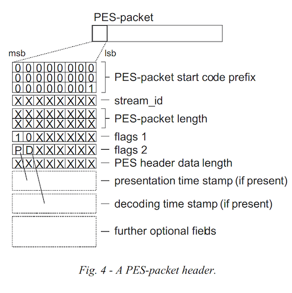

## ts

> ts 即 MPEG transport stream,是一种音视频封装格式,类似于 mp4,flv 等,内部封装的实际音视频数据( 如目前主流的 h264 编码的视频数据,aac 编码的音频数据 ),字幕数据等,以下简称 ts.

> 对 ts 的介绍文档出现在 MPEG-2 规范的第一部分,即 iso-13818-1[https://www.iso.org/standard/75928.html],主要介绍 ts 封装格式的内部具体组成。本文也主要记录 如何解析 ts 字节流，提取出音视频采样数据等信息。

## 为什么要了解 ts？

> ts 早期主要应用于无线广播系统,无线传输环境稳定性不好,所以设计原则就是容错性好,自我修复能力强(依赖客户端对 ts 流的处理),同时支持承载多个节目数据(program,如多个频道电视节目)。与 ts 相对的是 ps(program stream),主要应用于本地媒介存储,可靠性高,如 DVD。现在，因为苹果的流媒体点播技术方案`hls`最初使用的就是 ts 流,所以 ts 格式在流媒体领域还有很大的使用。

现在，主流浏览器都支持 h5 video 元素来播放音视频，但对分装格式的支持只限于 mp4、ogv、webm(macOs 10.6+ safari、win10 Edge 除外,可直接支持 hls),对绝大多数浏览器,要使用 hls 流媒体协议来做直播、点播，我们主要做的是:

1.  将 ts 格式 转封装为 mp4 格式
2.  使用 MSE API 来操作 buffer

> hls 协议主要就是对于一个播放列表(m3u8)的规定,还有自适应码率播放等,详见[https://tools.ietf.org/html/draft-pantos-http-live-streaming-19]

> 目前 hls 还可以使用 fmp4 流,且是个趋势。至少在浏览器端我们不需要做 ts mux 这部分工作。

## ts 流解析

可参考 wiki[https://en.wikipedia.org/wiki/MPEG_transport_stream] 和 iso-13818-1 规范

ts 流格式整体结构类似网络协议的数据包,一层包一层，每一层有 header,有 payload,最里面承载着原始流(音视频编码)数据


`最外层,ts流可分割成 连续的 长度为188字节的 ts packet,每个packet 以 0x47(71) 开始,Ox47也叫同步字节`

`ts packet 的payload **(最多 188-4 = 184字节)** 承载的是PAT PMT 或 PES 数据,注意PES数据会比较大,是由多个连续的ts packet共同组成的`

### ts packet

```
ts字节流
[71,x,x,x,....,71,x,x,x,....,71.....]
```

ts packet 的前四个字节叫做 ts header,头部信息

这头部信息里有三个关键指标

1. Payload unit start indicator (PUSI) 决定 ts packet 的 payload 承载的是一个新的 PES,还是当前 PES 中的一部分数据,将 ts packet 分割成 PES 时依赖这个标记

2) 是 PID,标识 这个 ts packet 中的 payload 承载的是什么数据,PAT? PMT? or 音视频的 PES？

3) Adaptation field control,表示 payload 中是否包含填充数据，用于将 ts packet 的 payload 拼接成完整的 PAT,PMT, PES 时 计算 payload 的偏移.

### pat pmt

一般在 现在流媒体点播 ts 流中,第一个 ts packet 就代表 pat,它的 pid = 0,第二个 ts packet 代表 pmt,之后都是 pes

> pat: (programe association table) 用来表示这个 ts 流中有多少节目,上面说过,ts stream 早期主要用于无线广播系统,承载电视节目信息,可以携带多个电视节目的信息,而在点播方面,也就是一个节目。在 pat 中每个节目有一些 2 字节的标识叫 program_number。在解析完 pat,提取出 program_number 后,在去解析剩下的 ts packet 时，首先我们要要找 pid === program_number 的 ts packet(一般就是紧随其后),这个 ts packet 就是 PMT。

> pmt: 表示一个节目的具体信息,即这个节目包含 h264 视频? aac 音频？ mp3 音频？流类型由 streamType 字段表示, 重要的,从 pmt 中提取那些原始流的 pid,例如代表视频的一个 pid，代表音频的一个 pid,在解析之后的所有 pes 时,根据 pid 就知道 ta 代表的是音频还是视频，相同类型数据要合并在一起。

主要的流类型对照表

| streamType |                             type                             |
| ---------- | :----------------------------------------------------------: |
| 0xcf       |                        SAMPLE-AES AAC                        |
| 0x0f       |    ISO/IEC 13818-7 ADTS AAC (MPEG-2 lower bit-rate audio)    |
| 0x15       |                  Packetized metadata (ID3)                   |
| 0xdb       |                        SAMPLE-AES AVC                        |
| 0x1b       | ITU-T Rec. H.264 and ISO/IEC 14496-10 (lower bit-rate video) |

### pes

pes 就是用来承载音视频原始数据的,对于视频编码数据,一般一个 pes 包含一个 access unit,代表一帧画面

由前 6 字节的 pes header + 3 字节的 pes extendsion + PES header data length + payload 组成




在 pes header 中有两个至关重要的项, **pts、dts** ,表示音视频数据的解码时间和展示时间

解码时间: 采样数据放入解码器缓存中被解码的时间

展示时间: 采样数据,画面、声音被播放的时间. 在 ts 层面 pts、dts 还用来做音画同步

对音频 pts、dts 是相同的,对视频,因为存在 I 帧,P 帧,B 帧,而 B 帧(双向参考帧)的解码需要依赖其`前后`的 I 和 P 帧,所以基本 pts 都大于 dts.

pts、dts 是以 timescale 为时间单位的, 1s = 90000 timescale

**pts、dts 计算方式**

在 ts 流解析时,很多的属性表示 分布在连续的两个字节中,可能由前一字节的后 N 位 和 后一字节的前 X 位共同组成，在计算它的具体数值时 只需结合按位与 & 按位或| 操作计算即可

但 pts、dts 由 33 位表示，这 33 bit 分布在 5 个连续的字节中，超出 按位操作的最大 32 位限制。

pts 在字节流中的表示,共 33 位

| 第一字节  | 第二字节 | 第三字节  | 第四字节 | 第五字节  |
| --------- | :------: | --------- | -------- | --------- |
| 占 5-7 位 | 占 8 位  | 占前 7 位 | 占 8 位  | 占前 7 位 |

计算:

(第一字节 & 0x0e) \* 536870912(1 <<29) 相当于左移 29 位，但只能用 x

\+ (第二字节 & 0xff) \* 4194304(1 <<22)

\+ (第三字节 & 0xfe) \* 16384(1<<14)

\+ (第四字节 & 0xff) \* 127 (1<<7)

\+ (第五字节 & 0xfe) / 2

** 采样数据 **

> 对 ts 的处理 主要就是从 ts 流中提取出采样数据(视频帧数据、音频采样数据),而与这些采样数据密切关联的数据就是解码时间、展示时间,ts 中就是 pts、dts,而 mp4 中 就是 baseMediaDecodeTime、compositionTime、compositionTime offset 等。

`pes 的 payload 承载的就是真实的例如主流的 h264,aac 编码器编码的采样数据. 而音视频编码格式又是如何结构化表示的呢?参见下一篇。`

[h264、aac 篇](./h264.md)
